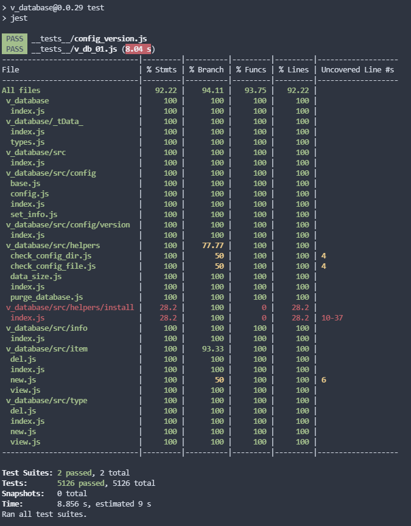

# **🧾 V_Database - README.md**    
 

 **Description**: _Simple way to make data available in your website/application for a single database._  
  
>---  
>### 🚧 **WARNING: APPLICATION STILL IN 🧱 [ALPHA] **  🚧  
>---   
## **🚕 Install and Setting up**    

Currently only through the github repo can be installed...
    But soon we will have something like:
          
          npm install v_database --save
          
    Soon... 🚀    

---
## **⚡ How to actually use it ?**    

here is an example code that is being used to export this example readme file in the fist place. 
          
          
          const v_database = require('v_database');
          
          v_database.type.new('books'); // returns true if it created new type or false if it already exists or fails
          v_database.type.new('links');
          
          v_database.item.new('books', {name: 'book title text' , description : 'demo' }); 
          v_database.item.new('links', {name: 'v-core9' , path : 'https://v-core9.com/' });
          
          v_database.item.new('books', { id: 'sample_id', name: 'book title text' , description : 'demo' }); //Adding ID will try to use it as an ID
    
          v_database.install() // trigger installation process 
          v_database.data_size() // returns the size of the data 
          v_database.purge_data() // removes all data from the database
        

---
## **📁 Project Folders Structure Info**    

Look into system folder for more info about project structure. 
    
    These are some important folders that are used when generating this document:
      📁 __tests__ /
      📁 __tests__ / v_database /
      📁 __tests__ / v_lidator /

      📁 _tDdata_ / 
      📁 _tDdata_ / _test-data / 

      📁 $_HELP_$ / 
      📁 $_HELP_$ / readme / 

      📁 src / 
      📁 src / config / 
      📁 src / config / version / 
      📁 src / helpers / 
      📁 src / helpers / install /
      📁 src / info / 
      📁 src / item / 
      📁 src / type /    

---

## ✅ Test Results and Coverage with Jest

>### 🔻 **WARRNING: GENERATED FILE NOTICE**  🔻 
> ⛔ Any Edits Done To Generated Files Will Be Overwritten Next Time These Files Get Re-Generated!  
>  
> _Made 💖 using [v_scrolls]("https://github.com/V-core9/v_scrolls")_      
> Last Updated:  2021/12/10 17:11:07 
